W A R M U P
CAPSTONE
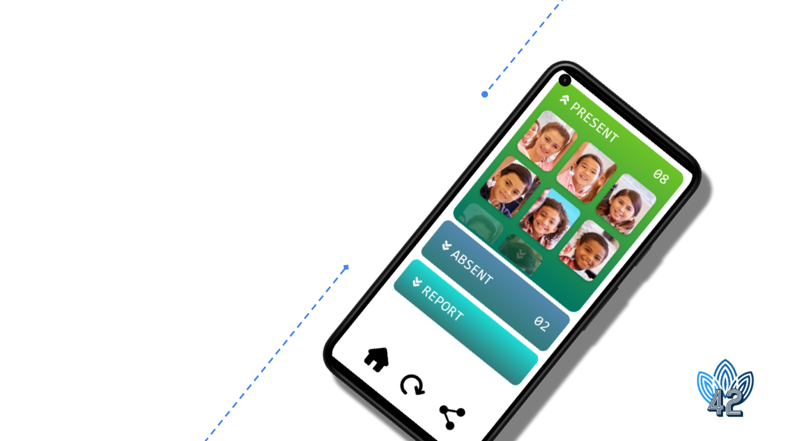
FACESHOT

USE CASES
Teacher Application
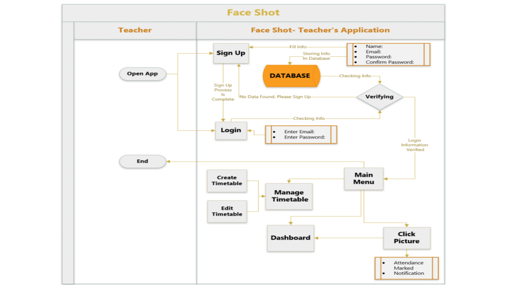
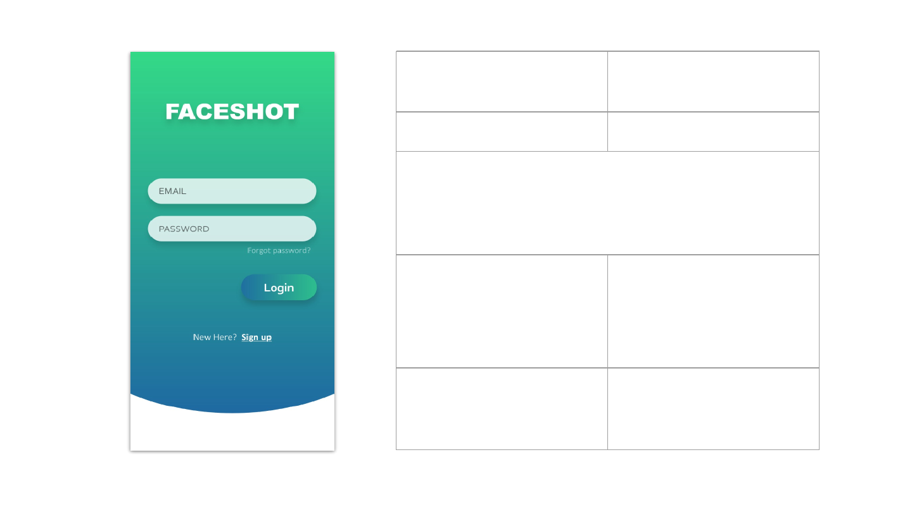
Use Case 1 Login
Actor User (Teacher)
The user launches the app and is greeted by the login
page. The user enters the login credentials, and if the
credentials are correct, the user is granted access to the
application.
Alternate Flow 1A If the user does not have a
registered account, they
click on the sign-up
button.
Alternate Flow 1B If he is unable to recall the
credentials, he presses the
forgot password link.
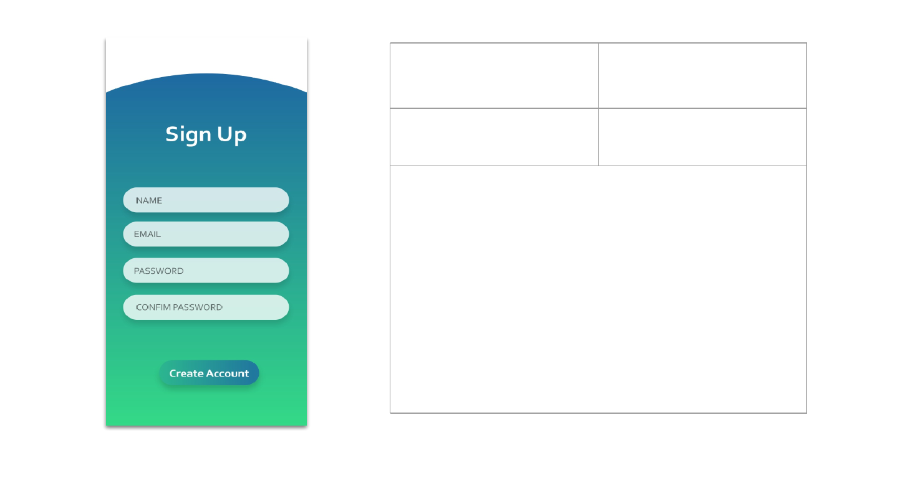
Use Case 1A Signup & Onboarding
Actor User (Teacher)
When the user clicks “Create Account”, button, the user
is taken to the signup page. Were the user fills in the
information such as email, password and completes the
account setup. Email address and password would be
stored in the database.
Then the user chooses a timetable for his subject,
where they input the name of the subject, and select
the time slots for the classes.

Use Case 1B Forgot Password
Actor User
When user clicks on forgot password, enters forgot
password page. User needs to enter the email to reset
the password. The password reset link will be sent to
the email address. Then user needs to enter new
password and confirm the new password. The new
password would be updated in the database.
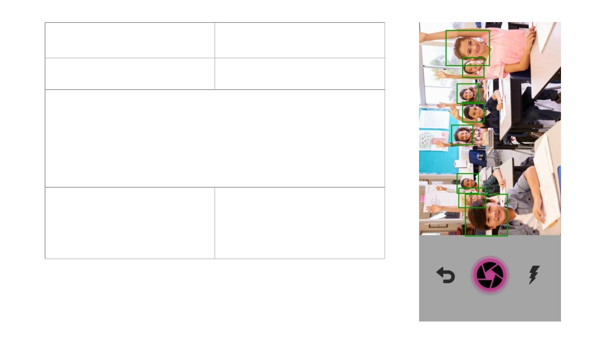
Use Case 2 Take Attendance
Actor User (Teacher)
The teacher selects the Snap picture icon in the Current Class
section, and the camera opens up. The teacher takes a clear
picture. This picture is sent to the server to our AI model, and all
faces are detected, and the attendance is taken successfully. After
completion, the user is redirected to the attendance page.
Alternate Flow 2A In case of an error, the user is
prompted to retake the picture.
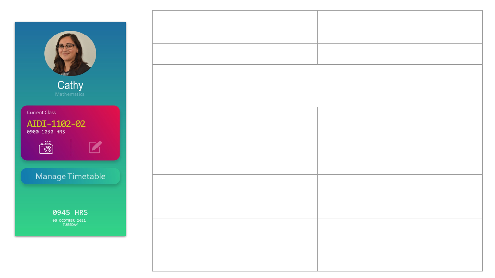
Use Case 3 Edit Attendance
Actor User (Teacher)
On the home page, the user clicks the dashboard button under the Current
Class
section to access the current attendance dashboard.
Alternate Flow 3A Dashboard button is inactive.
If no previous attendances were taken,
the dashboard button will be inactive,
and he will have to take attendance to
unlock the dashboard.
Alternate Flow 3B For already taken attendance, allow the
teachers to modify this day’s taken
attendances manually.
Alternate Flow 3C Third option for teacher is to view their
timetable

Use Case 3B Edit Attendance
Actor User (Teacher)
The teacher sees the list of all the present students, and are able to
modify the attendance manually.

Use Case 3C View Timetable
Actor User (teacher)
The teacher is able to view their already created timetable.

USE CASES
Student Application
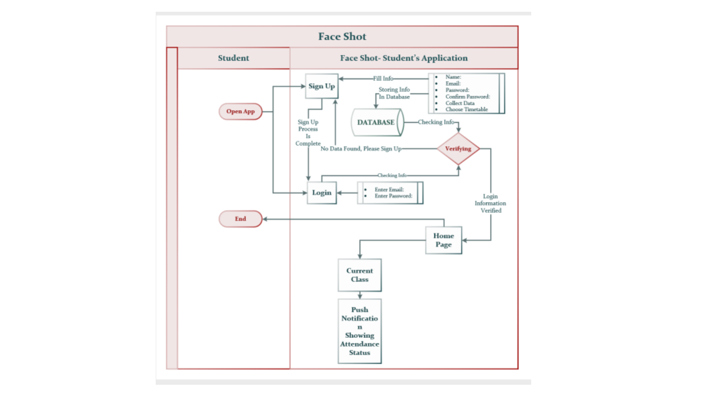

Use Case 1 Login
Actor User (Student)
The user launches the app and is greeted by the login page. The
user enters the login credentials, and if the credentials are
correct, the user is granted access to the application.
Alternate Flow 1A If the user does not have a registered
account, they click on the sign-up
button.
Alternate Flow 1B If he is unable to recall the credentials,
he presses the forgot password link.

Use Case 1A Signup
Actor User (Student)
When user opens the app first time to create the account, user
fills in the information such as Name, Email, Password and
completes the account setup. All the details would be stored in
the database.

Use Case 1B Forgot Password
Actor User (Student)
User needs to enter the email to reset the password. The input email id
will be
checked against the system records. If present, the password reset link
will be
sent to the email address. Then user needs to enter new password and
reenter
to confirm the new password. The new password would be updated in the
database.

Use Case 2 Scan face images
Actor User (Student)
After signup, the user has to complete the mandatory step of
scanning face images before going to the Home page.

Use Case 3 View current class details.
Actor User (Student)
In the home page, the user will be able to see the current class
details.

TECH STACK
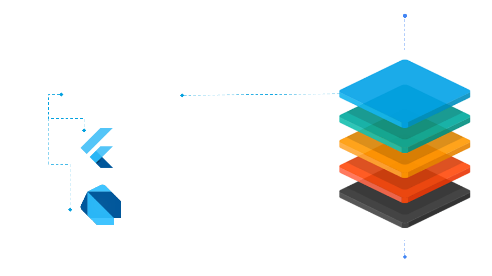
Front End (Mobile app)
Framework: Flutter
Language: Dart
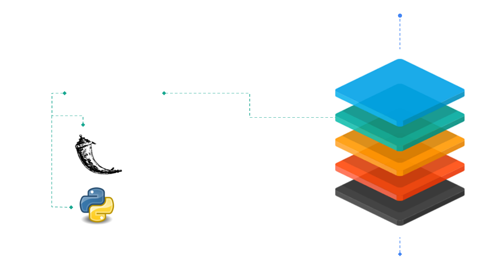
Communication
Framework: Flask
Language: Python

Computer
Vision
Framework: OpenCV
Language: Python
Framework: Tensorflow

Database, Auth,
Notifications
Framework: Firebase
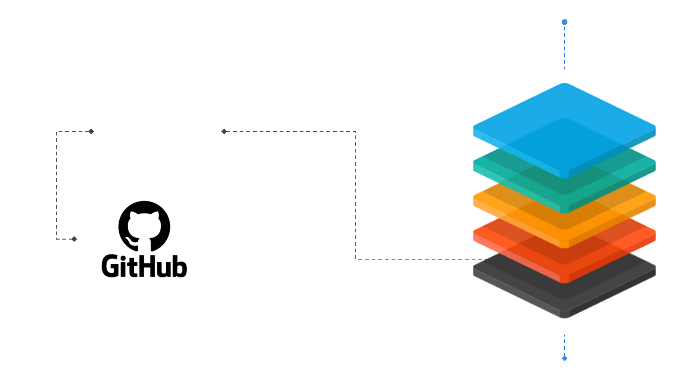
Version Control
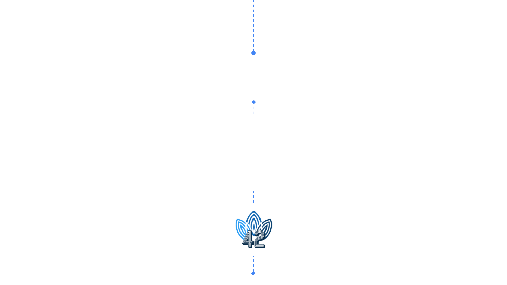
THANK YOU
Abhishek Joshi
Jerin Mathew
Praharsh Bhatt
Pruthviben Patel
Ram Raghu Sankar
